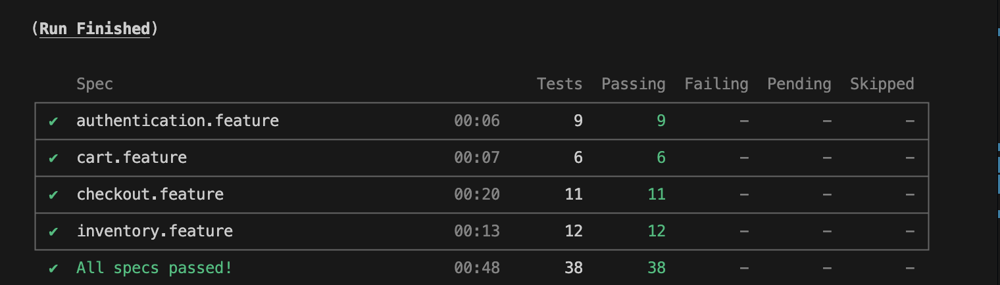

# Cypress_Cucumber
This is a project to showcase a test automation framework that I built using Cypress and Cucumber. 

**Site Under Test:**
- https://www.saucedemo.com

**Setup:**
-     cd cypress_cucumber
-     npm install

**To Run the Tests:**
- **Run All Tests in Electron:**
-     npm run cy:run
- **Run All Tests in Chrome:**
-     npm run cy:chrome
- **Run Tests in Headed Mode:**
-     npm run cy:open
- **Run Specific Feature Files:**
    - **Inventory:**
    -     npm run cy:run:inventory
    - **Cart:**
    -     npm run cy:run:cart
    - **Authentication:**
    -     npm run cy:run:login
    - **Checkout:**
    -     npm run cy:run:checkout

**Tools / Concepts:**
- Cypress
- Cucumber (BDD, Scenarios, & Scenario Outlines)
- Page Object Model (POM)
- esbuild
- JavaScript
- Fixtures
- Environment Variables
- Helper Functions
- Cypress Commands

