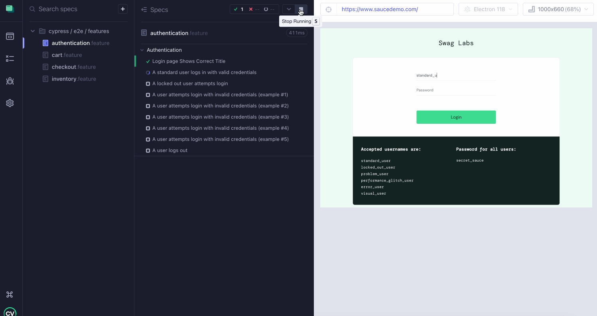
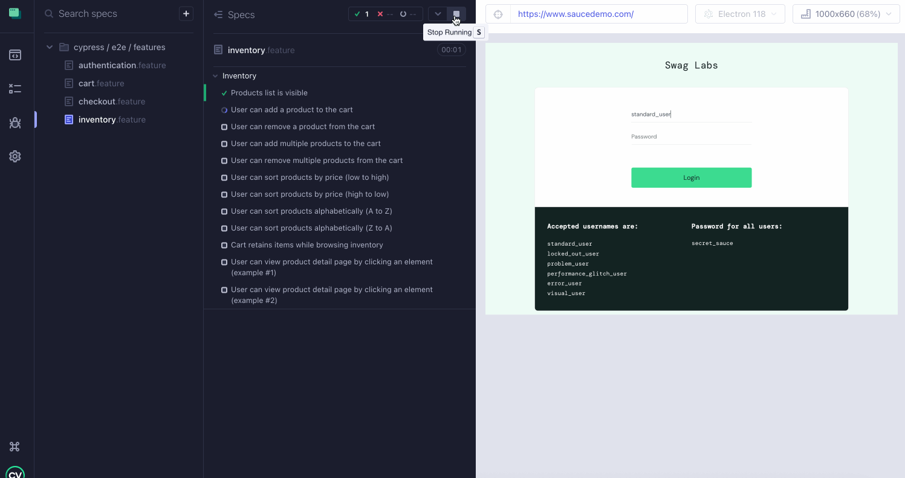
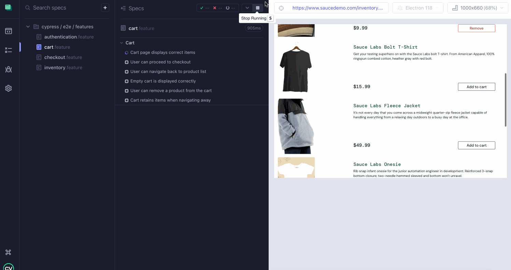
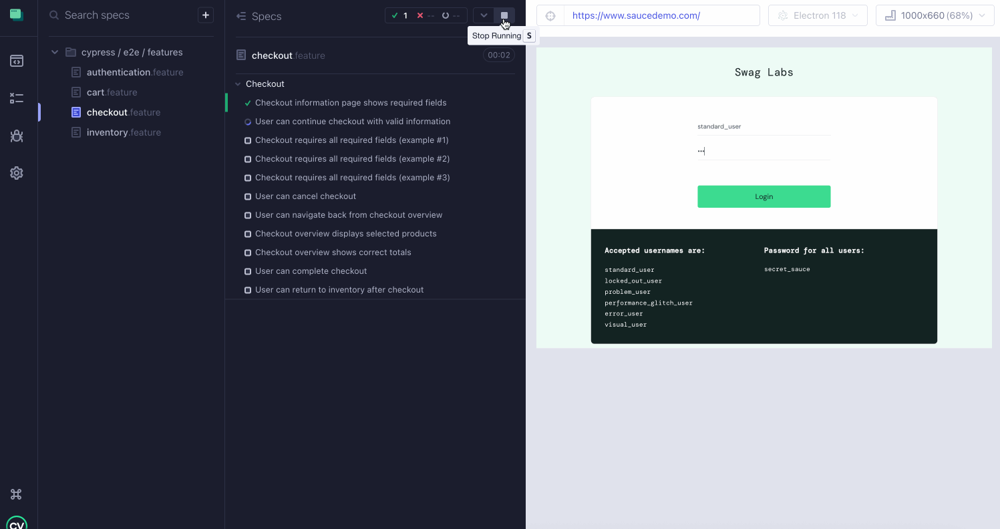

[](https://github.com/aristau/Cypress_Cucumber/actions)

# Cypress_Cucumber
> Professional Cypress + Cucumber automation framework demonstrating BDD, Page Object Model, CI/CD, and maintainable automation practices.

---

## ⭐ Project Overview

This project automates the **SauceDemo e-commerce site** ([https://www.saucedemo.com](https://www.saucedemo.com)):

- Login workflows  
- Product browsing and sorting  
- Cart functionality  
- Checkout process  

---

## 🏗 Architecture & Design

**Framework Highlights:**

- Cypress
- Page Object Model (POM)  
- Behavior-Driven Development (BDD) with Cucumber
- esbuild
- JavaScript
- Reusable helper functions  
- Fixture-based test data
- Cypress commands
- Environment variables
- CI/CD integration with GitHub Actions  

---

## 🚀 Running Tests Locally
**Setup:**
```
cd cypress_cucumber
npm install
```
**Run All Tests in Electron:**
```
npm run cy:run
```
**Run All Tests in Chrome:**
```
npm run cy:chrome
```
**Run Tests in Headed (GUI) mode:**
```
npm run cy:open
```
**Run Specific Feature Files:**

**- Inventory:**
```
npm run cy:run:inventory
```
**- Cart:**
```
npm run cy:run:cart
```
**- Authentication:**
```
npm run cy:run:login
```
**- Checkout:**
```
npm run cy:run:checkout
```

---

## ✅ Test Coverage

**Authentication:** Valid/invalid login, locked out user, required field validation

**Inventory:** Products visibility, add/remove single & multiple products, sorting, cart persistence  

**Cart:** Cart content, remove items, continue shopping, checkout navigation

**Checkout:** Required fields, overview validation, totals, taxes, checkout confirmation  


---

## 📈 Continuous Integration

**Automated Test Runs:** GitHub Actions executes all tests on every push or pull request.

**Failure Artifacts:** Screenshots & videos uploaded **only on failures.**

**CI Badge:** Provides clear visibility into test results

---


